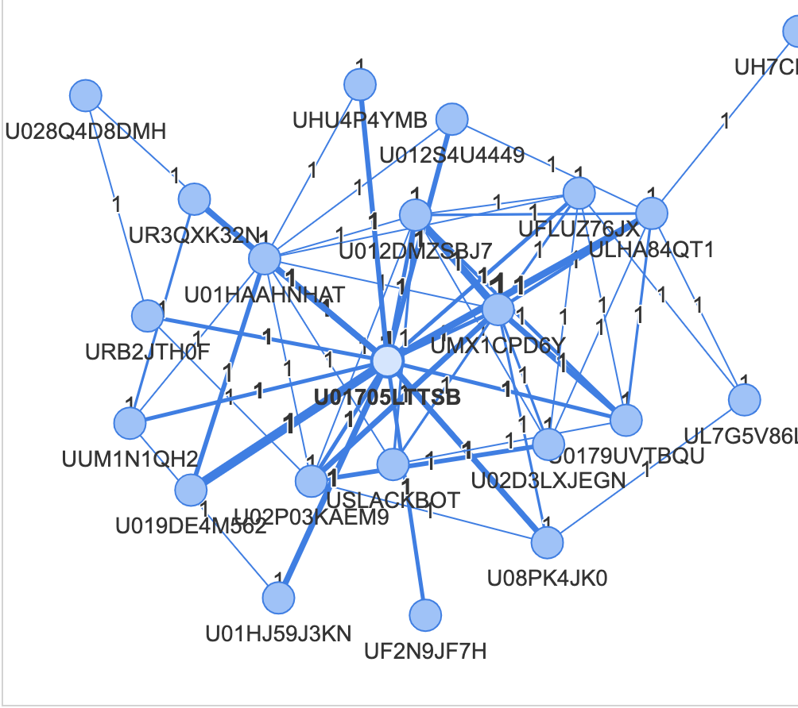
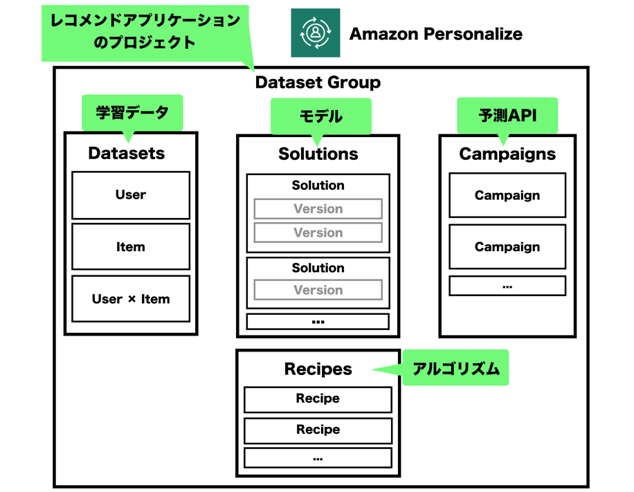

# aws_neptune
AWSのNeptuneを試したリポジトリ。他にlambda functionやglueの参考コードも置く。  
Kaggleのigraph描画を試したかったため、dockerよりDS-Notebookのjupyter labをコンテナインストールしてR環境を構築している

## aws-cli API リファレンスガイド
https://docs.aws.amazon.com/ja_jp/cli/latest/reference/neptune/index.html  
https://docs.aws.amazon.com/ja_jp/cli/latest/reference/sagemaker/index.html  

## Neptune ユーザーガイド
https://docs.aws.amazon.com/ja_jp/neptune/latest/userguide/intro.html

## ライフサイクルについて参考サイト  
https://github.com/aws-samples/amazon-sagemaker-notebook-instance-lifecycle-config-samples  
https://dev.classmethod.jp/articles/manage-s3-lifecycle-via-cli/

### (脱線)pyvis
slackからデータを取得し、RDB構造のままNetworkXで関係性を可視化・PyVisでより見やすい可視化を行った
  
コードはapi_slack以下  

## Personalize サンプルコード
https://github.com/aws-samples/amazon-personalize-samples/blob/master/next_steps/core_use_cases/related_items/personalize_aws_similar_items_example.ipynb  

特殊なワーディングの対応図　　
  
参考サイト：　[https://blog.ikedaosushi.com/entry/2019/06/14/011649](https://blog.ikedaosushi.com/entry/2019/06/14/011649)  

personalizeフォルダ以下に上記コードのクローンがあるが、personalizeのデータセットなどを調べたり削除したりしやすい関数をipywidgetsで追加しているので参考まで